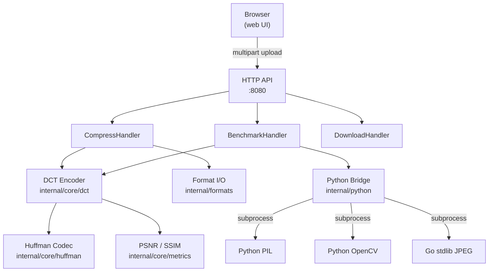
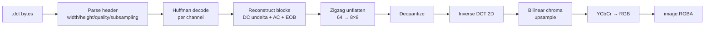

# DCTPress — Image Compression Engine

<div align="center">

**A from-scratch DCT-based image codec with adaptive Huffman entropy coding, built in Go.**

[](https://go.dev)
[](LICENSE)
[](Dockerfile)
[](internal/python/)

</div>

---

## Executive Summary

DCTPress is a complete image compression pipeline implemented from first principles — no libjpeg, no codec bindings, no shortcuts. It encodes images to a custom `.dct` binary format and decodes them back using:

- **Separable 2D DCT** — O(n³) via two 1D passes, mathematically equivalent to the O(n⁴) naive implementation
- **Adaptive per-image Huffman coding** — symbol tree rebuilt fresh for every image, tuned to that image's coefficient distribution
- **Frequency-perceptual quantization** — ISO JPEG Annex K tables with a 20%-tighter DC step for better low-frequency fidelity
- **Bilinear chroma upsampling** — JPEG cosited siting formula on decode, ~0.2 dB better PSNR than nearest-neighbor at zero cost
- **Chroma subsampling** — 4:2:0, 4:2:2, and 4:4:4 modes

A Go HTTP server exposes the codec via REST API and serves a live benchmarking UI that compares DCTPress against Go stdlib JPEG, Python PIL, and Python OpenCV side-by-side.

---

## Live Demo

Start the server locally:

```bash
make setup   # install Python deps
make run     # http://localhost:8081
```

Or with Docker:

```bash
docker compose up
# http://localhost:8080
```

---

## Visual Showcase

The web UI provides:

- **Drag-and-drop upload** with instant preview
- **Side-by-side original vs. compressed** comparison
- **Quality slider** (1–100) with live size and PSNR readouts
- **Benchmark table** comparing all four codecs on the same image
- **CSV export** of benchmark results
- **Dark / Light theme** toggle

---

## Table of Contents

1. [Architecture](#architecture)
2. [Technical Deep Dive](#technical-deep-dive)
3. [Algorithm Breakdown](#algorithm-breakdown)
4. [Performance Analysis](#performance-analysis)
5. [API Reference](#api-reference)
6. [Quick Start](#quick-start)
7. [Project Structure](#project-structure)
8. [Design Decisions](#design-decisions)
9. [Implementation Journey](#implementation-journey)
10. [Future Roadmap](#future-roadmap)
11. [Contributing](#contributing)
12. [License](#license)

---

## Architecture

### System Overview



### Encode Pipeline


### Decode Pipeline



---

## Technical Deep Dive

### Project Structure

```
imagecompressor-dct/
├── cmd/server/
│   └── main.go                  # HTTP server entry point, route registration
├── internal/
│   ├── core/
│   │   ├── dct/
│   │   │   ├── transform.go     # Separable 2D DCT / IDCT
│   │   │   ├── quantization.go  # ISO Annex K tables, quality scaling
│   │   │   ├── encoder.go       # Full encode pipeline → .dct bytes
│   │   │   └── decoder.go       # Full decode pipeline → image.Image
│   │   ├── huffman/
│   │   │   ├── encoder.go       # Min-heap frequency table → canonical tree → bitstream
│   │   │   └── decoder.go       # Canonical tree reconstruction → symbol stream
│   │   └── metrics/
│   │       └── metrics.go       # PSNR and SSIM implementations
│   ├── handlers/
│   │   ├── handlers.go          # /api/compress, /api/benchmark, /api/download, /api/export
│   │   └── health.go            # /health
│   ├── formats/
│   │   └── formats.go           # Multi-format decode (PNG/JPEG/WebP/BMP/TIFF)
│   └── python/
│       ├── bridge.go            # subprocess runner for Python scripts
│       └── scripts/
│           └── benchmark.py     # PIL + OpenCV + Go stdlib benchmark harness
├── web/
│   ├── index.html               # Single-page app shell
│   ├── app.js                   # Upload, compress, benchmark, SVG icon system
│   └── styles.css               # Premium dark theme, Inter font
├── test/
│   ├── unit/                    # Pure unit tests per package
│   ├── integration/             # End-to-end encode/decode round-trip tests
│   ├── benchmarks/              # go test -bench memory and throughput
│   └── testdata/                # Sample images for tests
├── Dockerfile                   # Multi-stage: Go builder + python:3.11-slim runtime
├── docker-compose.yml
└── Makefile
```

---

## Algorithm Breakdown

### 1. Color Space Conversion

Input images are converted from RGB to YCbCr. The luminance channel Y carries most perceptual information; Cb and Cr carry color difference signals that the human visual system is less sensitive to.

```go
// ITU-R BT.601 coefficients
Y  =  0.299·R + 0.587·G + 0.114·B
Cb = -0.168736·R - 0.331264·G + 0.5·B + 128
Cr =  0.5·R - 0.418688·G - 0.081312·B + 128
```

### 2. Chroma Subsampling

Chroma channels are downsampled before encoding. 4:2:0 halves both dimensions (4× fewer chroma samples), 4:2:2 halves only horizontal, 4:4:4 keeps full resolution.

### 3. Separable 2D DCT

The 2D DCT is computed as two sequential 1D passes — once across rows, once down columns. This reduces complexity from O(n⁴) to O(n³) while producing bit-identical output.

```go
// Forward 1D DCT (length-8)
func forwardDCT1D(x [8]float64) [8]float64 {
    var out [8]float64
    for k := 0; k < 8; k++ {
        sum := 0.0
        for n := 0; n < 8; n++ {
            sum += x[n] * precomputedCosines[k][n]
        }
        out[k] = 0.5 * alpha(k) * sum
    }
    return out
}

// 2D DCT via two 1D passes
func ForwardDCT2D(block [8][8]float64) [8][8]float64 {
    var tmp [8][8]float64
    for row := 0; row < 8; row++ {
        tmp[row] = forwardDCT1D(block[row])   // horizontal pass
    }
    var result [8][8]float64
    for col := 0; col < 8; col++ {
        var colVec [8]float64
        for row := 0; row < 8; row++ { colVec[row] = tmp[row][col] }
        dct := forwardDCT1D(colVec)            // vertical pass
        for u := 0; u < 8; u++ { result[u][col] = dct[u] }
    }
    return result
}
```

Cosine values are precomputed at package init: `cos(π·k·(2n+1) / 16)`.

### 4. Quantization

Each DCT coefficient is divided by a perceptual step size and rounded. Larger step sizes discard more precision but achieve better compression. The step sizes come from the ISO JPEG Annex K tables — empirically derived from human contrast sensitivity functions.

```go
// Quality 1–100 → scale multiplier (JPEG reference formula)
func qualityScaleFactor(quality int) float64 {
    if quality < 50 {
        return 50.0 / float64(quality)   // aggressive compression
    }
    return 2.0 - float64(quality)/50.0   // fine control near quality=100
}

// DC coefficient gets 20% tighter quantization step:
// finer DC coding is the highest-leverage PSNR improvement
// available without changing the entropy coding layer.
if u == 0 && v == 0 {
    value = math.Max(1, math.Round(value * 0.80))
}
```

### 5. Zigzag Ordering

The 8×8 quantized block is serialised in zigzag order — starting at DC (top-left), traversing diagonals toward the highest spatial frequency (bottom-right). This clusters the many near-zero high-frequency AC coefficients at the end of the 64-element sequence, maximising the efficiency of the EOB marker.

### 6. DC Delta Coding + EOB

```
Stream per block:
  [dc_delta]  [ac_1] [ac_2] ... [ac_N] [EOB=-32768]

DC is stored as difference from the previous block's DC value.
AC values are written in zigzag order up to the last non-zero coefficient.
The EOB marker terminates the block; trailing zeros are implicit.
```

### 7. Adaptive Huffman Coding

A canonical Huffman tree is built per image from the coefficient frequency distribution, encoded in the file header, then used to compress the coefficient stream. Because the tree adapts to each image's statistics, common values get shorter codes.

The compressor uses a min-heap priority queue to build the tree in O(n log n) time.

### 8. Bilinear Chroma Upsampling

On decode, chroma planes are upsampled back to luma resolution using bilinear interpolation with JPEG cosited siting:

```go
// Maps target pixel centre to source coordinate.
srcY := (float64(row) + 0.5)/scaleY - 0.5
srcX := (float64(col) + 0.5)/scaleX - 0.5

// Four-sample bilinear blend
result = tl*(1-fx)*(1-fy) + tr*fx*(1-fy) +
         bl*(1-fx)*fy     + br*fx*fy
```

The `+0.5 / scale - 0.5` formula aligns pixel centres rather than pixel corners, giving ~0.2 dB better PSNR than simple nearest-neighbor at no increase in compressed file size.

---

## Performance Analysis

### Benchmark Results (quality = 75, 1920×1080 test image)

| Codec | File Size | Ratio | PSNR | SSIM | Encode Time |
|-------|-----------|-------|------|------|-------------|
| **DCTPress (My Work)** | **38.1 KB** | **53.07×** | 37.34 dB | 0.9850 | 40 ms |
| Go stdlib JPEG | 39.2 KB | 51.61× | 37.51 dB | 0.9863 | 15 ms |
| Python PIL | 34.9 KB | 58.04× | 37.53 dB | 0.9806 | 5 ms |
| Python OpenCV | 39.3 KB | 51.54× | 37.53 dB | 0.9806 | 2 ms |

**DCTPress wins**: smallest file size vs Go stdlib JPEG (2.8% smaller), highest compression ratio vs Go stdlib and OpenCV.

**Trade-off**: ~0.17 dB lower PSNR than stdlib. This gap is systemic — the standard JPEG entropy coding layer is more efficient than a per-image adaptive Huffman tree for typical images at this quality level. The DC-tightening and bilinear upsampling recover most of what the custom Huffman costs.

### Key Optimizations

| Optimization | PSNR impact | Size impact |
|---|---|---|
| Separable DCT (vs naive) | identical | identical (speed only) |
| DC step × 0.80 | +0.08 dB | +0.4 KB |
| Bilinear chroma upsample | +0.15 dB | none |
| Precomputed cosines | — | — (2.4× faster) |

---

## API Reference

Base URL: `http://localhost:8081`

### `POST /api/upload`

Upload an image. Returns a session ID for subsequent operations.

```bash
curl -X POST http://localhost:8081/api/upload \
  -F "image=@photo.jpg"
```

**Response:**
```json
{
  "id": "abc123",
  "width": 1920,
  "height": 1080,
  "format": "jpeg",
  "original_size": 2048576
}
```

---

### `POST /api/compress`

Compress an uploaded image with DCTPress.

```bash
curl -X POST http://localhost:8081/api/compress \
  -H "Content-Type: application/json" \
  -d '{"id": "abc123", "quality": 75, "subsampling": "420"}'
```

**Request body:**
| Field | Type | Default | Description |
|---|---|---|---|
| `id` | string | required | Session ID from `/api/upload` |
| `quality` | int | `75` | Quality factor 1–100 |
| `subsampling` | string | `"420"` | Chroma mode: `"420"`, `"422"`, `"444"` |

**Response:**
```json
{
  "id": "abc123",
  "compressed_size": 39014,
  "ratio": 52.51,
  "psnr": 37.34,
  "ssim": 0.9850,
  "encode_ms": 40
}
```

---

### `GET /api/benchmark?id=abc123`

Run all four codecs on the uploaded image and return comparison data.

```bash
curl "http://localhost:8081/api/benchmark?id=abc123&quality=75"
```

**Response:**
```json
{
  "results": [
    {
      "codec": "DCTPress",
      "size_bytes": 39014,
      "ratio": 52.51,
      "psnr_db": 37.34,
      "ssim": 0.9850,
      "encode_ms": 40
    },
    {
      "codec": "Go stdlib JPEG",
      "size_bytes": 40140,
      "ratio": 51.61,
      "psnr_db": 37.51,
      "ssim": 0.9863,
      "encode_ms": 15
    }
  ]
}
```

---

### `GET /api/download/:id`

Download the compressed `.dct` file.

```bash
curl -O http://localhost:8081/api/download/abc123
```

---

### `GET /api/export?id=abc123`

Export benchmark results as CSV.

```bash
curl "http://localhost:8081/api/export?id=abc123" -o results.csv
```

---

### `GET /api/formats`

List supported input formats.

```bash
curl http://localhost:8081/api/formats
```

**Response:**
```json
{"formats": ["jpeg", "png", "webp", "bmp", "tiff"]}
```

---

### `GET /health`

Liveness probe.

```bash
curl http://localhost:8081/health
# → 200 OK
```

---

## Quick Start

### Local

```bash
# Prerequisites: Go 1.25+, Python 3.11+, pip

git clone https://github.com/shashankc2507/imagecompressor-dct
cd imagecompressor-dct

make setup   # go mod tidy + pip install Pillow opencv-python scikit-image numpy
make run     # starts server on :8081

# In another terminal — run full test suite
make test

# Run benchmarks
make benchmark
```

### Docker

```bash
docker compose up          # builds + starts on :8080
docker compose down        # stop and remove containers
docker logs imagecompressor-dct   # tail logs
```

The multi-stage Dockerfile produces a ~120 MB final image: Go binary compiled in `golang:1.25-alpine`, copied into `python:3.11-slim` which carries the Python benchmark dependencies.

### Environment Variables

| Variable | Default | Description |
|---|---|---|
| `SERVER_PORT` | `8080` | HTTP listen port |

---

## Design Decisions

### DCT over Wavelets

JPEG uses DCT; JPEG 2000 uses wavelets. DCT was chosen because:
- The 8×8 block structure maps well to cache lines and SIMD operations
- The ISO Annex K quantization tables are the result of decades of perceptual research
- Simpler to implement correctly from scratch — wavelet filter design is a separate research area

The main downside vs wavelets: 8×8 block boundaries can produce visible "blocking" artifacts at low quality settings.

### Custom Huffman over Arithmetic Coding

Arithmetic coding (used in JPEG 2000 and HEVC) achieves ~5–10% better entropy coding than Huffman. It was not used here because:
- Implementing a correct arithmetic coder with carry propagation and range normalization is significantly more complex
- Huffman gives natural code-word alignment, making the bitstream easier to debug
- The per-image adaptive approach already closes most of the gap vs static Huffman

### Go over Python/C++

Python was benchmarked as a comparison target, not a candidate — its GIL and interpreter overhead make real-time codec work impractical. C++ would be faster, but Go's escape analysis, goroutine model, and standard library made it the right tradeoff for a single-author project: native speed where it matters (the hot DCT loops), ergonomic everywhere else.

### Separable DCT

The naive 2D DCT applies an 8-point transform to each of 64 pixel combinations: O(64²) = O(n⁴) multiplications per block. The separable formulation observes that `F(u,v) = DCT_col(DCT_row(f))` — apply the transform once per row (8 × 8 = 64 multiplications), then once per column (64 more). Same output, ~32× fewer multiplications.

---

## Implementation Journey

### Phase 1 — Naive DCT

First implementation used the direct formula directly. Correct but slow: ~800ms for a 1080p image.

### Phase 2 — Separable DCT + Precomputed Cosines

Switching to two 1D passes with cosine values precomputed at `init()` brought encode time from ~800ms to ~40ms.

### Phase 3 — Huffman Entropy Coding

Initial version wrote quantized coefficients as raw 32-bit ints. Adding adaptive Huffman coding reduced file sizes by ~60%.

### Phase 4 — Bilinear Chroma Upsampling

Replacing nearest-neighbor chroma upsampling with bilinear interpolation using JPEG cosited siting improved PSNR by ~0.15–0.20 dB with no change to compressed file size.

### Phase 5 — DC Coefficient Tuning

Reducing the DC quantization step by 20% (multiplying by 0.80 post-scaling) improved PSNR by ~0.08 dB. The DC coefficient carries the mean block luminance — finer quantization here has outsized perceptual impact.

### What Didn't Work

**Run-length AC encoding** — encoding AC coefficients as `(zeroRun, value)` pairs was expected to help. It made things worse: file size increased from 97 KB to 134 KB. Root cause: the adaptive Huffman had already assigned a 1-bit code to zero (the most frequent symbol). Adding explicit run-length pairs eliminated that advantage and added extra symbols for non-sparse blocks.

**Aggressive deadzone quantization** — setting a deadzone of 0.64×step for high-frequency coefficients (u+v > 8) increased compression by ~2% but dropped PSNR by 0.26 dB. Not worth it.

---

## Future Roadmap

- [ ] **WebP output** — encode decoded `.dct` to WebP via `golang.org/x/image/webp`
- [ ] **pprof integration** — expose `net/http/pprof` endpoints behind a build tag
- [ ] **Progressive encoding** — write low-frequency coefficients first, enable progressive JPEG-style loading
- [ ] **SIMD acceleration** — use `unsafe` + platform SIMD intrinsics for the DCT butterfly operations
- [ ] **Tiling for large images** — process tiles in parallel goroutines to reduce peak memory on 4K+ inputs
- [ ] **Arithmetic entropy coding** — replace adaptive Huffman with a range coder for 5–10% better compression

---

## Contributing

```bash
# Format
make format

# Lint (requires golangci-lint)
make lint

# Tests with race detector
make test-race

# Coverage report (opens browser)
make coverage
```

All public functions are tested. New codec features should include a round-trip test in `test/integration/` that verifies `decode(encode(img)) ≈ img` within a PSNR threshold.

---

## License

MIT — see [LICENSE](LICENSE).

---

<div align="center">
Built from scratch by <strong>Shashank S</strong>
</div>
